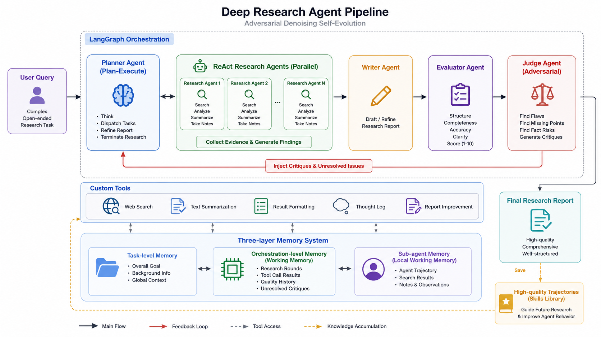

# Deep Research Agent

A LangGraph / LangChain based multi-agent research system for complex open-ended research tasks. The project automates the full workflow from research brief generation, draft report writing, parallel web search, long-context webpage summarization, Supervisor-driven iterative planning, quality evaluation, Red Team critique, final report generation, and high-quality trajectory distillation into reusable Skill Memory.



## Motivation

Deep research tasks are rarely solved by a single model response. A useful research agent must understand the user goal, decompose the topic, retrieve fresh external evidence, summarize long webpages, refine the report over multiple iterations, and actively check for coverage gaps or factual risks.

This project turns that process into a traceable multi-agent pipeline. LangGraph provides the state-machine workflow, LangChain provides model and tool abstractions, and structured state objects make intermediate research artifacts explicit and reusable.

## Key Features

- **Multi-agent orchestration**: Draft Writer, Supervisor, Researcher, Evaluator, Red Team, Final Writer, and Skill Memory are composed into an end-to-end LangGraph workflow.
- **Dynamic Supervisor control**: The Supervisor decides whether to continue research, dispatch subtopics, refine the draft, record reasoning, or terminate the research loop.
- **Parallel Research Agents**: Multiple `ConductResearch` tasks can be launched concurrently with `asyncio.gather`.
- **Search-augmented toolchain**: Tavily search, URL deduplication, raw webpage summarization, formatted source output, and a pluggable search provider factory.
- **Quality feedback loop**: The Evaluator scores draft quality across coverage, accuracy, and coherence, while the Red Team performs adversarial critique and injects unresolved issues back into the Supervisor context.
- **Skill Memory**: High-quality research trajectories are distilled into reusable process skills and retrieved through a vector store for similar future tasks.
- **Configurable model routing**: `config.yml` controls OpenAI-compatible model endpoints, role-specific model handles, token limits, timeouts, and search parameters.

## Agent Roles

| Agent / Module | Responsibility                                                                                                 | Key File                                    |
| -------------- | -------------------------------------------------------------------------------------------------------------- | ------------------------------------------- |
| Draft Writer   | Converts the user query into a research brief and produces an initial report draft                             | `deep_research/agents/draft_agent.py`     |
| Supervisor     | Maintains research state and dynamically schedules tools, subtopic research, draft refinement, and termination | `deep_research/agents/supervisor.py`      |
| Researcher     | Executes ReAct-style search, reasoning, tool calls, and research compression for one subtopic                  | `deep_research/agents/research_agent.py`  |
| Evaluator      | Performs structured draft quality evaluation and records score history                                         | `deep_research/agents/evaluator_agent.py` |
| Red Team       | Performs adversarial critique to find omissions, reasoning gaps, and factual risks                             | `deep_research/agents/red_team_agent.py`  |
| Final Writer   | Synthesizes the research brief, draft, and findings into the final report                                      | `deep_research/agent_builder.py`          |
| Skill Memory   | Extracts, distills, stores, and retrieves reusable high-quality research process skills                        | `deep_research/skills/`                   |

## Tool Environment

| Tool / Capability       | Purpose                                                  | Notes                                                             |
| ----------------------- | -------------------------------------------------------- | ----------------------------------------------------------------- |
| `tavily_search`       | Web search and webpage content retrieval                 | Default search backend, extensible through the provider factory   |
| `think_tool`          | Records intermediate reasoning and planning decisions    | Used by the Supervisor and Researcher loops                       |
| `refine_draft_report` | Rewrites the draft based on research findings            | Called by the Supervisor during iterative research                |
| Webpage Summarizer      | Summarizes long raw webpage content                      | Uses structured`Summary` output                                 |
| Search Provider Factory | Registers, loads, caches, and configures search backends | Defaults to Tavily and supports custom providers                  |
| Skill Vector Store      | Stores and retrieves research skills                     | Uses Chroma when available and falls back to a local vector index |

## Skill Memory

Skill Memory is designed to preserve reusable research process knowledge, not factual conclusions. A skill may describe how to decompose a topic, which source types to prioritize, how to organize evidence, which failure modes to avoid, and how to structure the final report.

The current implementation has three stages:

1. **Trajectory extraction**: Extracts the current run trajectory from the research brief, draft report, Supervisor messages, Researcher raw notes, quality scores, and Red Team critiques.
2. **Skill distillation**: Converts high-quality trajectories into structured `ResearchSkill` objects, including applicability, planning guidance, research guidance, writing guidance, evaluation guidance, and common failure modes.
3. **Vector retrieval and reuse**: Embeds skills into a vector store, retrieves relevant skills for future tasks, and injects them into the Agent context as process guidance.

Default configuration prioritizes Chroma:

```yaml
skill_memory:
  enabled: true
  max_retrieved_skills: 3
  min_quality_score: 8.0
  vector_store:
    backend: chroma
    collection_name: research_skills
    embedding_backend: hash
    similarity_threshold: 0.35
```

## Quick Start

The fastest way to run the project is to use the existing `config.yml`, replace the placeholder credentials and model names, then launch the LangGraph agent from a notebook or a short Python script. Python 3.11 is recommended.

### 1. Install Dependencies

```powershell
python -m venv .venv
.\.venv\Scripts\activate
pip install -r requirements.txt
```

Optional, but recommended if you want persistent Skill Memory:

```powershell
pip install chromadb
```

### 2. Configure Runtime Services

Add your own `config.yml` and set:

- `stages.prod.cognition.openai.base_url`
- `stages.prod.cognition.openai.api_key`
- `stages.prod.cognition.openai.default_model`
- `stages.prod.search.tavily.api_key`
- every `stages.prod.roles.<role>.handle`

like below:

```yaml
stages:
  prod:
    cognition:
      openai:
        base_url: https://your-openai-compatible-endpoint
        api_key: your-api-key
        default_model: your-default-model
    search:
      backend: tavily
      tavily:
        api_key: your-tavily-key
        max_results: 3
        include_raw_content: true
    roles:
      supervisor:
        backend: openai
        handle: your-supervisor-model
      researcher_main:
        backend: openai
        handle: your-researcher-model
      writer:
        backend: openai
        handle: your-writer-model
```

Optional environment variables:

| Variable                    | SPurpose                                                    |
| --------------------------- | ----------------------------------------------------------- |
| `CONFIG_PATH`             | Path to the configuration file, defaulting to`config.yml` |
| `STAGE`                   | Configuration stage, defaulting to`prod`                  |
| `DEEP_RESEARCH_LOG_LEVEL` | Runtime log levelS                                          |

### 3. Verify Local Imports

This check does not call external APIs:

```powershell
python -m compileall deep_research
```

You can also verify that the config loader and date utility work:

```powershell
python -c "from deep_research.utils import get_today_str; print(get_today_str())"
```

### 4. Run with Notebook

```powershell
jupyter notebook run.ipynb
```

Open `run.ipynb`, run the setup cells, and execute the final `ainvoke` cell. This is the recommended debugging path because the notebook prints intermediate status and renders the final report with Markdown.

### 5. Run with Python

Use this PowerShell command for a minimal end-to-end run:

```powershell
@'
import asyncio

from langchain_core.messages import HumanMessage
from langgraph.checkpoint.memory import InMemorySaver

from deep_research.agent_builder import deep_researcher_builder


async def main():
    agent = deep_researcher_builder.compile(checkpointer=InMemorySaver())
    result = await agent.ainvoke(
        {
            "messages": [
                HumanMessage(
                    content="Please research how agent memory is designed in modern deep research systems and write a structured report."
                )
            ]
        },
        config={
            "configurable": {
                "thread_id": "quickstart-demo",
            },
            "recursion_limit": 50,
        },
    )
    print(result["final_report"])


asyncio.run(main())
'@ | python -
```

If the run succeeds, the generated report is printed to stdout. If Skill Memory is enabled, high-quality trajectories are persisted under `deep_research/_skill_memory/` by default.

## Outputs

A full run typically produces the following state fields:

| Field                | Meaning                                             |
| -------------------- | --------------------------------------------------- |
| `research_brief`   | Research-oriented task brief                        |
| `draft_report`     | Initial or iteratively refined report draft         |
| `notes`            | Compressed findings returned by Research Agents     |
| `raw_notes`        | Raw tool calls and intermediate research records    |
| `quality_history`  | Structured quality score history from the Evaluator |
| `active_critiques` | Unresolved Red Team critiques                       |
| `retrieved_skills` | Historical skills retrieved for the current task    |
| `final_report`     | Final research report                               |

Sample reports are available in `results/`.
